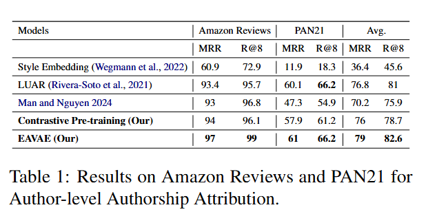
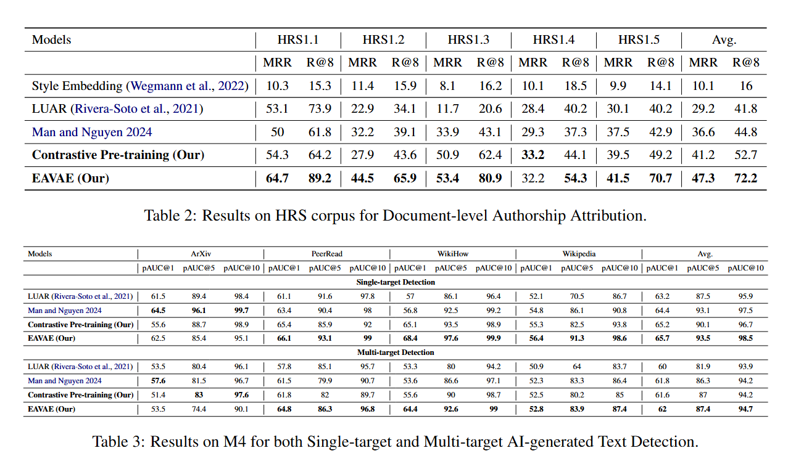

# EAVAE: Explainable Author-Variational Autoencoder

A PyTorch Lightning implementation of an Explainable Author-Variational Autoencoder (EAVAE) for learning disentangled style and content representations in text. This model learns to separate an author's writing style from the semantic content, enabling applications in authorship verification, style transfer, and text generation with controlled stylistic attributes.

## 🎯 Overview

EAVAE is a neural architecture that combines:
- **Style Encoder**: Captures author-specific writing patterns (e.g., word choice, sentence structure)
- **Content Encoder**: Extracts semantic meaning independent of style
- **Generator**: Reconstructs text conditioned on both style and content representations
- **VAE Framework**: Uses variational autoencoders for regularized latent space learning

The model achieves disentanglement through adversarial discriminators and mutual information regularization, ensuring that style and content representations remain independent.
The model is published at [Huggingface](https://huggingface.co/Hieuman/avae.v0.1)

## 🏗️ Architecture

```
Input Text
    ├─> Style Encoder (Bidirectional Qwen) ─> Style VAE ─> Style Latent (z_s)
    └─> Content Encoder (GTE-Qwen) ────────> Content VAE ─> Content Latent (z_c)
                                                    ↓
                                          [z_s ⊕ z_c] → Generator (Qwen)
                                                    ↓
                                            Reconstructed Text
```

### Key Components

1. **Style Encoder** (`src/model/encoder.py`)
   - Bidirectional transformer (Qwen2/Qwen3) for capturing style patterns
   - VAE bottleneck for regularization
   - Configurable with LoRA for efficient fine-tuning

2. **Content Encoder** (`src/model/encoder.py`)
   - Dense retrieval model (e.g., GTE-Qwen2-1.5B)
   - Extracts semantic representations
   - Independent from stylistic variations

3. **Generator** (`src/model/generator.py`)
   - Causal language model (Qwen2.5/Qwen3)
   - Conditioned on concatenated style and content embeddings
   - Optional LoRA adaptation

4. **Discriminators** (`src/model/model.py`)
   - Style discriminator: Encourages content latents to be style-invariant
   - Content discriminator: Encourages style latents to be content-invariant

## 📦 Installation

### Requirements
- Python 3.11+
- CUDA 12.0+ (for GPU training)
- 80GB+ GPU memory recommended for full model training

### Setup

```bash
# Clone the repository
git clone https://github.com/yourusername/avae.git
cd avae

# Create conda environment
conda create -n avae python=3.10
conda activate avae

# Install dependencies
pip install -r requirements.txt
```

### Key Dependencies
- `torch>=2.0.0`
- `lightning>=2.5.0`
- `transformers>=4.36.0`
- `flagembedding>=1.3.4`
- `peft` (for LoRA)
- `wandb` (for experiment tracking)

## 🚀 Quick Start

### 1. Data 
You can found the data for Petrain Style Encoder at: [[Pretrain_data](https://huggingface.co/collections/Hieuman/document-level-authorship-datasets-67e87663cb587c938def821b)]

For the EAVAE training, you can found the data at: [[EAVAE_data](https://huggingface.co/datasets/Hieuman/avae)]

### 2. Training

#### Stage 1: Pretrain Style Encoder (Optional)

Train a contrastive style encoder on author identification:

```bash
python -m src.main \
    --config_file scripts/configs/style_encoder.yaml \
    --checkpoint_dir checkpoints/style_encoder \
    --nodes 1 \
    --devices 4
```

#### Stage 2: Train EAVAE

Train the full disentanglement model:

```bash
bash scripts/finetune.sh
```

Or manually:

```bash
python -m src.main \
    --config_file scripts/configs/avae.yaml \
    --checkpoint_dir checkpoints/avae/my_experiment \
    --run_name avae-v1 \
    --nodes 1 \
    --devices 4 \
    --global_batch_size 32 \
    --learning_rate 5e-5
```

### 3. Evaluation

Evaluate on authorship verification benchmarks:

```bash
python -m src.trainer.eval \
    --checkpoint_dir checkpoints/avae/my_experiment \
    --config_file scripts/configs/avae_test.yaml \
    --eval_dataset HRS  # or MUD, PAN20, PAN21, amazon_reviews
```

## 📊 Datasets

### Training Datasets

EAVAE is trained on diverse multi-author corpora:
- **Reddit** 
- **Blog Authorship Corpus**
- **Amazon Reviews**
- **Goodreads Reviews**
- **IMDb Reviews**
- **New York Times Comments**
- **Yelp Reviews**
- **News Articles** (RealNews)
- **Wikipedia** 
- And more (see [Pretrain_data](https://huggingface.co/collections/Hieuman/document-level-authorship-datasets-67e87663cb587c938def821b))

### Evaluation Benchmarks

- **HRS** (HIATUS Reddit Stories): multi-genre authorship verification
- **MUD** (Multi-User Detection): Reddit-based authorship attribution
- **PAN20/PAN21**: PAN competition authorship verification tasks
- **Amazon Reviews**: Product review authorship verification
- **M4**: Multi-domain for AI-generated text detection





## ⚙️ Configuration

All experiments are configured via YAML files in `scripts/configs/`.

### Main Configuration Parameters

#### Model Architecture
```yaml
# Encoder models
style_encoder_model_name_or_path: "Qwen/Qwen2-1.5B"
content_encoder_model_name_or_path: "Alibaba-NLP/gte-Qwen2-1.5B-instruct"
generator_model_name_or_path: "Qwen/Qwen2.5-1.5B-Instruct"

# Architecture settings
embedding_dim: 1536
pooling_method: mean
dropout_prob: 0.1
use_vae: true

# LoRA settings
use_lora: false
lora_r: 16
lora_alpha: 32
lora_dropout: 0.1
```

#### Loss Weights
```yaml
reconstruction_loss_weight: 1.0      # Reconstruction quality
vae_loss_weight: 1.0e-5              # KL divergence regularization
style_discriminator_loss_weight: 1.0  # Style-invariant content
content_discriminator_loss_weight: 1.0 # Content-invariant style
constraint_loss_weight: 0.1          # Consistency with pretrained encoders
```

#### Training Hyperparameters
```yaml
learning_rate: 5.0e-5
max_epochs: 3
max_steps: 40000
global_batch_size: 32
effective_batch_size: 32  # With gradient accumulation
grad_norm_clip: 1.0
warmpup_proportion: 0.1
weight_decay: 0.0
```

## 🔬 Model Details

### Disentanglement Objectives

1. **Reconstruction Loss**: Measures how well the generator reconstructs the input
   ```
   L_recon = -log P(x | z_s, z_c)
   ```

2. **VAE KL Loss**: Regularizes latent distributions
   ```
   L_KL = KL(q(z|x) || p(z))
   ```

3. **Adversarial Discriminator Losses**:
   - Style discriminator tries to predict style from content latents (minimize for content encoder)
   - Content discriminator tries to predict content from style latents (minimize for style encoder)

4. **Constraint Loss**: Maintains consistency with pretrained reference encoders

5. **Mutual Information Regularization** (optional): Further encourages independence

### Training Strategy

- **FSDP (Fully Sharded Data Parallel)**: Efficient distributed training
- **Mixed Precision (BF16)**: Faster training with lower memory
- **Gradient Checkpointing**: Trade compute for memory
- **Cyclic KL Annealing**: Gradually increases KL weight for stable training

## 📈 Logging and Monitoring

The project uses Weights & Biases (wandb) for experiment tracking:

```yaml
logger_type: wandb
logger_name: avae-experiment
```

Metrics logged:
- Training losses (reconstruction, KL, discriminator, total)
- Evaluation metrics (AUC, accuracy on verification tasks)
- Learning rates and gradient norms
- System metrics (GPU memory, throughput)

## 🗂️ Project Structure

```
avae/
├── src/
│   ├── main.py                    # Main training script
│   ├── args.py                    # Argument definitions
│   ├── model/
│   │   ├── model.py              # AVAE main model
│   │   ├── encoder.py            # Style & content encoders
│   │   ├── generator.py          # Text generator
│   │   ├── vae.py                # VAE components
│   │   ├── loss.py               # Loss functions
│   │   └── utils.py              # Model utilities
│   ├── data_modules/
│   │   ├── style_dataloader.py   # Style encoder data
│   │   ├── disentanglememt_dataloader.py  # AVAE data
│   │   ├── preprocess.py         # Data preprocessing
│   │   ├── constants.py          # Dataset paths
│   │   └── templates.py          # Prompt templates
│   └── trainer/
│       ├── trainer.py            # Training loop
│       ├── gradcache_trainer.py  # Gradient cache trainer
│       └── eval.py               # Evaluation scripts
├── scripts/
│   ├── finetune.sh              # Training script
│   ├── preprocess.sh            # Preprocessing script
│   └── configs/
│       ├── avae.yaml            # Main AVAE config
│       ├── avae_pretrain.yaml   # Pretraining config
│       ├── style_encoder.yaml   # Style encoder config
│       └── avae_test.yaml       # Evaluation config
├── checkpoints/                  # Model checkpoints
├── data/                        # Dataset files
└── requirements.txt             # Python dependencies
```
<!-- 
## 🎓 Citation

If you use this code in your research, please cite:

```bibtex
@article{avae2024,
  title={AVAE: Learning Disentangled Style and Content Representations for Authorship Analysis},
  author={Your Name},
  year={2024}
}
``` -->

## 📝 License

This project is licensed under the MIT License - see the LICENSE file for details.

## 🤝 Contributing

Contributions are welcome! Please feel free to submit a Pull Request.

### Development Setup

```bash
# Install development dependencies
pip install -r requirements.txt

# Run tests (if available)
pytest tests/
```

## 🐛 Troubleshooting

### Common Issues

1. **OOM (Out of Memory)**
   - Reduce `global_batch_size`
   - Enable `use_cpu_offload: true`
   - Use gradient accumulation (`effective_batch_size > global_batch_size`)
   - Enable activation checkpointing

2. **FSDP Errors**
   - Ensure all model components are properly wrapped
   - Check that `nodes` and `devices` match your hardware
   - Try switching to DDP strategy for debugging

3. **NaN Loss**
   - Reduce learning rate
   - Increase warmup steps
   - Check loss weight balancing
   - Enable gradient clipping

## 📧 Contact

For questions or issues, please open an issue on GitHub or contact [your-email@example.com].

## 🙏 Acknowledgments

- Built with [PyTorch Lightning](https://lightning.ai/)
- Uses models from [Hugging Face Transformers](https://huggingface.co/transformers/)
- Inspired by disentanglement research in VAEs and style transfer

---

**Note**: This is research code. For production use, additional testing and optimization may be required.
